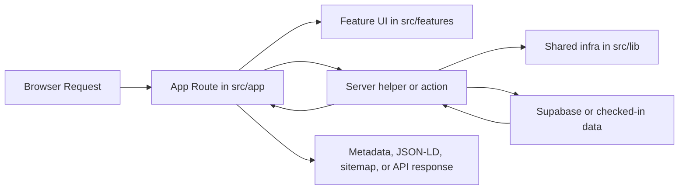

# Architecture Guide

This document gives a fast orientation to the current application structure so contributors can place new code in the right layer and avoid rebuilding old cross-feature bottlenecks.

## High-Level Shape

The app is a Next.js App Router project with a feature-oriented structure:

- `src/app` owns routes, route layouts, metadata entry points, and API handlers.
- `src/features` owns most domain logic, UI, feature-local helpers, and feature-owned server modules.
- `src/actions` owns shared server actions that are triggered by forms or client mutations.
- `src/lib` owns cross-feature infrastructure such as locale helpers, metadata builders, Supabase setup, security headers, and generic utilities.
- `src/content/grammar` owns typed grammar source content.
- `public/data` owns checked-in generated datasets consumed by the app and public API.
- `supabase` owns SQL migrations and Edge Functions.
- `tests/e2e` owns Playwright smoke and browser-level feature regressions.

## Architecture Contract

This repository follows the Coptic Compass feature-oriented architecture. New
code should preserve these boundaries:

- `src/app` is the route layer. Page files and route handlers should parse route
  inputs, set route config, call feature helpers, and return UI or responses.
  Avoid putting business rules, provider orchestration, or large data-fetching
  workflows directly in route files.
- `src/features/<feature>` is the default home for product logic. Feature UI,
  hooks, display helpers, domain utilities, and feature-owned server code belong
  here.
- `src/features/<feature>/lib/server` is the default home for server-only
  feature queries, route-handler implementations, provider orchestration, and
  persistence workflows.
- `src/actions` is for server-action entry points triggered by forms or client
  mutations. Keep actions focused; when logic grows, move the implementation
  into a feature-owned module and let the action delegate to it.
- `src/lib` is shared infrastructure only. Add code here only when it is
  genuinely cross-feature, such as locale helpers, metadata builders, Supabase
  setup, security headers, OCR proxy infrastructure, validation, or notification
  transport.

If a module starts to mix route parsing, UI layout, provider calls, persistence,
and domain decisions, split it before adding more behavior.

## Readable Feature Decomposition

Feature modules should be split by responsibility once a surface grows beyond a
single simple workflow. The preferred pattern is an orchestration shell that
passes typed data and callbacks into focused components, hooks, or server
helpers.

Use these boundaries when decomposing larger files:

- UI shells wire data, auth state, selected modes, and feature sections.
- Components own one visible section or interaction surface.
- Hooks own one stateful behavior, such as filters, provider selection,
  attachments, keyboard shortcuts, session progression, scrolling, or mutation
  submission.
- Server modules own one pipeline stage, query family, provider integration, or
  persistence concern.
- Schema and validation modules are grouped by domain shape, such as common,
  grammar, dictionary, AI, forms, meanings, relations, or inflections.

Recent established patterns:

- Admin dashboard sections are feature components behind an
  `AdminDashboardSections` orchestration layer.
- Practice keeps `PracticePageClient` as the page shell and moves deck filters,
  session progression, review submission, shortcuts, setup, cards, answer
  context, and completion UI into named hooks/components.
- Admin RAG ingestion keeps the public ingestion entry point stable while source
  readers, OCR reconciliation, chunking, embeddings, persistence, JSON-source
  ingestion, and logging live in separate modules.
- Dictionary entry rendering keeps `DictionaryEntry` as a composition layer and
  renders heading, meanings, morphology, relations, dialect forms, and notes
  through semantic components.
- Public OpenAPI and dictionary validation files keep stable public entry
  points while schema and validation groups live in smaller modules.
- Shenute keeps the route and client shell stable while conversation,
  composer, messages, attachments, provider controls, session sidebar, and the
  floating Shenute surface live in feature-owned components and hooks.

Do not split code only to reduce line count. Split where the extracted name
matches a real product or technical responsibility and makes future changes
safer.

## Routing Model

The route tree is intentionally split into two main groups:

- `src/app/(site)/[locale]`
  Public localized pages such as `/en/dictionary`, `/nl/grammar`, and `/en/publications`.
- `src/app/(app)`
  Legacy non-localized routes and app-entry routes. Most of these redirect into localized public pages or host global utility pages like `/api-docs`, login, and auth callbacks.

That split supports two goals:

- public pages get stable localized URLs, canonical metadata, sitemap coverage, and structured data
- legacy paths remain supported without duplicating the real implementation

Dictionary routing follows this same model:

- `/[locale]/dictionary` is the localized search and browse surface.
- `/[locale]/entry/[id]` is the canonical localized dictionary entry route.
- `/dictionary` and `/entry/[id]` are legacy redirects.
- `/[locale]/dictionary/[id]` is intentionally not a canonical entry route.

## Main Layers

### 1. Route Layer

Use `src/app` for:

- page entry points
- route layouts
- `generateMetadata` and route-level metadata
- Next API route handlers
- sitemap and robots definitions

Pages should stay thin when possible. Prefer fetching or assembling view data in feature-owned helpers instead of growing large route files.

API route handlers should usually be thin adapters too. The preferred pattern is
to keep route config (`runtime`, `maxDuration`, etc.) in `src/app/api/.../route.ts`
and delegate the implementation to `src/features/<feature>/lib/server/...`.

### 2. Feature Layer

Use `src/features/<feature>` for domain-specific code.

Typical subfolders:

- `components`
- `lib`
- `lib/server` for feature-owned server-side helpers and queries
- `hooks`
- `renderers`
- `build` for dataset transformation helpers where relevant

Examples:

- dictionary search and entry rendering live under `src/features/dictionary`
- grammar dataset, lesson rendering, reading/study workspace UI, API shaping, and learner state live under `src/features/grammar`
- public API documentation, Swagger UI wiring, and the combined OpenAPI document live under `src/features/api-docs`
- analytics dashboards and linguistic drill-downs live under `src/features/analytics`
- admin dashboard presentation, workspace modes, and queue UI live under `src/features/admin`
- admin RAG route implementations live under `src/features/admin/lib/server`
- Shenute UI, chat orchestration, retrieval, feedback, and history logic live under `src/features/shenute`
- audience preferences, opt-in requests, Resend sync, and content releases live under `src/features/communications`

This is the default home for new product logic.

### 3. Server Actions

Use `src/actions` for reusable server actions that are not best colocated inside a single route.

Current pattern:

- top-level actions such as auth, contact, profile, and exercises stay as focused files
- admin actions are split by domain under `src/actions/admin`

Admin action domains currently include:

- submissions
- moderation
- releases
- audience
- shared admin context helpers

Keep `src/actions/admin.ts` as a thin public entrypoint, not a new logic hub.

Compatibility shims in `src/actions` are acceptable during refactors, but the
domain implementation should remain feature-owned once a feature boundary
exists.

### 4. Shared Infrastructure

Use `src/lib` for cross-feature utilities that are genuinely shared.

Examples:

- locale and routing helpers
- metadata and SEO helpers
- structured data builders
- communication brand constants and notification email shells
- OCR proxy infrastructure shared by routes, actions, and ingestion workflows
- CSP and security headers
- Supabase client/server wiring
- validation helpers
- server revalidation utilities

Shared code belongs here only when at least two features truly need it. If logic is feature-specific, keep it in the feature.

## Data and Content Flow

There are two main content sources in the project.

### Grammar Content

- Source of truth: `src/content/grammar`
- Generated output: `public/data/grammar/v1`
- Export command: `npm run data:grammar:export`

The grammar source is typed and reviewed in source form, then exported into JSON that is reused by:

- public pages
- the grammar API
- the OpenAPI docs surface
- sitemap freshness logic

### Dictionary Data

- Source of truth in the app runtime: `public/data/dictionary.json`

The dictionary currently ships from a normalized checked-in dataset and is read by the public dictionary UI, analytics drill-downs, the dictionary search API, and sitemap/SEO helpers.

The app-facing JSON should contain structured fields such as dialect forms,
localized senses, gendered and dialect-restricted meanings, Greek context,
hierarchical inflections, and entry relations. Raw/source-only text fields,
attestations, source dumps, and one-off migration artifacts should stay out of
the runtime payload.

For field-level dictionary conventions, use the [Dictionary JSON Guide](./dictionary-json.md).

Dictionary part-of-speech codes, grammar abbreviations, and grammar-label tooltip behavior are centralized in `src/features/dictionary/grammarRegistry.ts` with matching tests. Prefer extending that registry over scattering one-off label parsing across UI, analytics, or structured-data helpers.

## SEO and Discoverability

SEO is centralized instead of being improvised page by page.

Main entry points:

- `src/lib/metadata.ts`
- `src/features/seo/lib/structuredData.ts`
- `src/features/seo/lib/openGraph.ts`
- `src/features/seo/lib/openGraphCards.tsx`
- `src/features/seo/lib/server/sitemaps.ts`
- `src/app/sitemap.xml/route.ts`
- `src/app/sitemaps/[id]/route.ts`
- `src/app/robots.ts`
- `src/app/api/og/route.tsx`

Low-level URL, JSON-LD, Open Graph, and sitemap primitives remain under
`src/lib`; feature-facing SEO composition belongs under `src/features/seo`.
Public localized pages should usually use those feature helpers and, when
appropriate, inject JSON-LD through `src/components/StructuredData.tsx`.

Private routes, redirect routes, and transient auth flows should use `noindex` metadata.

## Supabase and Background Work

The app uses Supabase in three layers:

- Next app auth and data access through `src/lib/supabase`
- SQL rollout through `supabase/migrations`
- background or webhook-style work through `supabase/functions`

Shared Edge Function logic lives under `supabase/functions/_shared`.

More involved workers should stay decomposed by responsibility instead of growing into single long files. The content release worker is a good example: its env/config, REST helpers, notification persistence, and broadcast delivery logic now live in separate modules under `supabase/functions/process-content-release`.

## Communications and Public Docs

Communication code is split between feature-level templates and shared delivery
infrastructure:

- audience preferences, content releases, and release email builders live under
  `src/features/communications`
- server-side audience commands, double opt-in and private preference requests,
  and Resend contact sync
  live under `src/features/communications/lib/server`
- contact-message email templates live under `src/features/contact`
- shared notification dispatch, queueing, and generic branded fallback HTML live
  under `src/lib/notifications`
- product communication constants and email color tokens live in
  `src/lib/communications/mailBrand.ts`

The database keeps mailing state separated by responsibility:

- `audience_contacts` stores the current topic preference snapshot
- `audience_consent_events` stores append-only topic consent evidence
- `audience_opt_in_requests` stores hashed double opt-in tokens and exact
  requested topics
- `audience_preference_requests` stores short-lived, single-use hashed tokens
  for no-account preference management
- `audience_suppressions` stores active and historical delivery restrictions
- `provider_webhook_events` is the idempotent inbox for provider callbacks
- `notification_events` stores logical notification intent
- `notification_deliveries` stores provider delivery attempts and outcomes
- `notification_email_jobs` stores durable worker state, retry timing, and leases

Only trusted service-role workflows write consent evidence, suppressions,
provider events, and queued email jobs. The
`claim_notification_email_jobs` database function is deliberately unavailable
to browser roles and uses bounded leases plus row locking to support later retry
workers without duplicate claims.

All user-driven topic changes pass through `apply_audience_preferences`. The
service-role-only function serializes updates per normalized email, updates the
current snapshot, and appends evidence only for topics that actually changed.
The contact confirmation and public preference functions lock and consume their
token rows inside the same transaction. Token GET pages are request-bound,
`noindex`, and read-only; only explicit POST actions mutate preferences.

Resend integration keeps consent and targeting separate. Segments identify the
audience slice for Broadcast delivery, while Topics represent the provider-side
preference state. Audience sync explicitly writes every managed Topic as
`opt_in` or `opt_out`; it does not infer consent from Segment membership.
Content release sends require a full-access Resend key, the relevant Segment
ID, the matching Topic ID, and a visible provider unsubscribe footer. Missing
configuration blocks queueing or finalizes the release back to `approved` with
an admin-facing error instead of falling back to direct Email API sends.

The Resend webhook route verifies Svix signatures before parsing JSON, inserts
the provider event into `provider_webhook_events` before side effects, and
returns idempotent success for duplicate `svix-id` deliveries. Webhook side
effects are disabled unless `RESEND_WEBHOOK_PROCESSING_ENABLED=true`. When
enabled, provider events may only make local marketing state more restrictive:
global unsubscribes clear all local topics and create a suppression, Topic
opt-outs clear only that topic, and bounces, complaints, or suppressed events
create active suppressions. Provider webhooks must never opt a topic in.

Public-facing documentation is part of the product surface. Keep `README.md`,
the docs in `docs/`, and README screenshots in `public/readme` aligned with the
current brand assets, typography, product vocabulary, and UI patterns. The brand
book is the source of truth for naming, logo usage, and public copy posture.
The UI guide is the source of truth for implementation-level page rhythm,
control surfaces, CTA behavior, and mobile layout conventions.

## Testing Strategy

Current testing layers:

- unit and integration-style coverage with Vitest in `src/**/*.test.ts`
- end-to-end smoke and feature-regression coverage with Playwright in `tests/e2e`
- source guardrails for routing/layout and raw error disclosure regressions
- CI enforcement in `.github/workflows/ci.yml`

Where a domain has enough behavior to justify it, prefer smaller domain-specific test files over one giant catch-all harness. The admin action tests now follow that pattern with shared helpers plus separate release, moderation, and audience test files.

Error-handling changes should include focused coverage for public copy mapping,
API JSON error payloads, and UI disclosure behavior. The guardrail tests should
continue catching obvious raw-error leaks, including direct `error.message`
rendering, direct `payload.error` rendering, `alert(` usage, and environment
variable names outside technical/developer surfaces.

CI currently runs:

- high-severity dependency audit
- formatting checks for changed source and documentation files
- dead-code check with Knip
- lint
- Vitest
- production build
- Playwright end-to-end tests

If you add routing, metadata, or SEO behavior, prefer small regression tests close to the helper or route surface.

## Placement Rules

When adding new code, use these defaults:

- New public page: `src/app/(site)/[locale]/...`
- Legacy redirect or utility route: `src/app/(app)/...`
- Feature-specific UI or logic: `src/features/<feature>/...`
- Feature-specific server query/helper: `src/features/<feature>/lib/server/...`
- Shared server action: `src/actions/...`
- Cross-feature utility: `src/lib/...`
- Grammar source content: `src/content/grammar/...`
- Generated grammar dataset: `public/data/grammar/v1/...`
- Migration or Edge Function work: `supabase/...`

Before creating a new shared helper, ask whether the helper would still make
sense if the feature were removed. If the answer is no, keep it in the feature.

## Conventions Worth Preserving

- Prefer feature-owned modules over new cross-feature megafiles.
- Keep page files and route handlers thin when extraction improves clarity.
- Split large client containers into orchestration plus smaller layout or interaction helpers once multiple modes, panels, or drill-down behaviors accumulate.
- Split large server workflows by pipeline stage or data boundary instead of
  hiding source reading, provider calls, persistence, and logging in one file.
- Keep schema, validation, and OpenAPI modules grouped by domain shape or public
  contract section.
- Keep SEO logic centralized in shared helpers.
- Treat `public/data` as generated or checked-in data, not the place for new business logic.
- Use compatibility shims only as temporary migration tools, then remove them once imports are updated.
- Add tests for behavior that affects routing, metadata, structured data, or public API contracts.

## Contributor Architecture Checklist

Use this quick review before opening a PR that adds or moves code:

- Does every new file live in the narrowest layer that can own it?
- Are `src/app` pages and route handlers still thin?
- Did feature-specific logic stay out of `src/lib`?
- Did server-only feature logic go under `src/features/<feature>/lib/server`?
- Did server actions stay focused on mutation/action boundaries?
- Did large UI, hook, schema, validation, or pipeline files stay split by named
  responsibility?
- Are SEO, metadata, sitemap, and structured-data changes using shared helpers?
- Are generated JSON/data artifacts kept out of business logic?
- Did tests cover changed public routes, APIs, metadata, or persistence behavior?

## Typical Request Flow

## When in Doubt

If a change feels like it could live in several places, prefer the narrowest home that still keeps the code discoverable:

- feature first
- shared infra second
- route layer only for route concerns

That bias keeps the codebase readable as the product grows.
